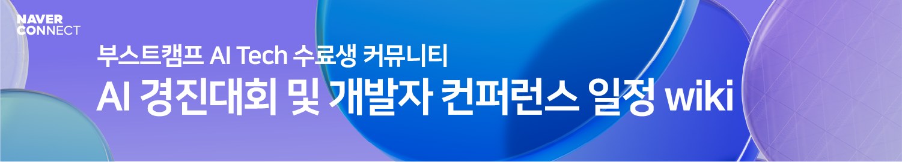

# Events wiki

> AI 경진대회 및 개발자 컨퍼런스 일정 등 유용한 정보를 우리 모두의 성장을 위해 공유해 주세요!
> 함께 만드는 커뮤니티인만큼 아래의 양식을 참고하여 다양한 정보를 나눠주세요. :) 

## 부스트캠프 AI Tech 수료생 커뮤니티 이벤트 🎁
|일정|이벤트 명|
|------|---|
|2022.11.10|Welcome Again!|
|2023.01.12|Again 마스터클래스|
|2023.04.NN|Again Tech Talk|

## 경진대회 🧑🏻‍💻

- [NFL Big Data Bowl 2023](https://www.kaggle.com/competitions/nfl-big-data-bowl-2023/overview/timeline)
  + 주최/주관: Kaggle
  + 대회 일정: 22.10.10 ~ 23.1.9

- [제조업 노동자 근골격계 부담요인 예방 인공지능 데이터구축 HACKATHON](https://nadomaker.space/bbs/board.php?bo_table=notice&wr_id=69)
  + 주최: NIA, 주관: 에이치엔아이씨 (주), (주)글로비트, 나사렛대학교 산학협력단, 동의대학교 산학협력단, 부산시 기계공업 협동조합
  + 대회 일정: 22.12.12 ~ 23.1.11
  
- [유전체 정보 품종 분류 AI 경진대회](https://dacon.io/competitions/official/236035/overview/description)
  + 주최: 충남대학교, 티엔티리써치, AI Frenz, 주관: 데이콘
  + 참가: 22.12.26 ~ 23.1.16

- [2023 교원그룹 AI 챌린지 <예선>](https://dacon.io/competitions/official/236042/overview/description)
  + 주최: (주)교원, 주관: 데이콘
  + 참가: 22.12.26 ~ 23.1.16

- [OTTO – Multi-Objective Recommender System](https://www.kaggle.com/competitions/otto-recommender-system/overview)
  + 주최/주관: Kaggle
  + 참가: 22.11.1 ~ 23.1.24

### 종료된 경진대회 💼

 펼쳐서 보기 👇🏻 

 

- [LGU+ 콘텐츠 추천 경진대회](https://github.com/UpstageAI/2022-lguplus-AI-Ground)
  + 주최: LG U+, 주관: Upstage
  + 참가 접수: 22.10.10 ~ 10.31

- [국방 AI 경진대회](https://aiconnect.kr/competition/detail/213)
  + 주최: 국방부, 과학기술정보통신부, 주관: 정보통신기획평가원, 한국공개소프트웨어협회, 이노베이션 아카데미
  + 참가 접수: 22.9.30 ~ 11.2 
  
- [2022 국립국어원 인공 지능 언어 능력 평가 대회](https://corpus.korean.go.kr/)
  + 주최: 문화체육관광부 국립국어원
  + 참가 접수: 22.10.4 ~ 11.4 

- [Open Problems - Multimodal Single-Cell Integration](https://www.kaggle.com/competitions/open-problems-multimodal/overview/timeline)
  + 주최/주관: Kaggle
  + 참가 접수: 22.8.15 ~ 22.11.8

- [Medical AI Challenge 2022 - Sleep AI Challenge ver.3](https://maic.or.kr)
  + 주최: 서울대학교병원
  + 참가 접수: 22.10.19 ~ 11.11 

- [Feedback Prize - English Language Learning](https://www.kaggle.com/competitions/feedback-prize-english-language-learning/overview/timeline)
  + 주최/주관: Kaggle
  + 참가 접수: 22.8.30 ~ 22.11.22  

- [2022 Kaggle Machine Learning & Data Science Survey](https://www.kaggle.com/competitions/kaggle-survey-2022/discussion)
  + 주최/주관: Kaggle
  
- [Medical AI Challenge 2022 - CDM Ai Challenge ver 2: Predicting Hypoxemia](https://maic.or.kr)
  + 주최: 서울대학교병원
  + 참가 접수: 22.11.25 ~ 12.06 

- [2022 한국어 멀티세션 데이터 해커톤 대회](https://makersweb.net/event/25175)
  + 주최: 한국지능정보사회진흥원, 미디어젠
  + 참가 접수: 22.11.24 ~ 22.12.7

- [제4회 대학생 AI x BOOKATHON 대회](https://dacon.io/competitions/official/236035/overview/description)
  + 주최: 성균관대학교,산학연기술혁신공유협의회, 주관: 강원대학교LINC 3.0사업단, 고려대학교 LINC 3.0사업단, 성균관대학교 LINC 3.0사업단, 충남대학교 LINC 3.0사업단
  + 참가: 22.11.07 ~ 22.12.22
  
- [Novozymes Enzyme Stability Prediction](https://www.kaggle.com/competitions/novozymes-enzyme-stability-prediction/overview/timeline)
  + 주최/주관: Kaggle
  + 참가 접수: 22.9.21 ~ 22.12.27
  
- [G2Net Detecting Continuous Gravitational Waves](https://www.kaggle.com/competitions/g2net-detecting-continuous-gravitational-waves/overview/timeline)
  + 주최/주관: Kaggle
  + 참가: 22.10.4 ~ 22.12.27

  
## 세미나 & 특강 📖

### 종료된 세미나 & 특강 💼

 펼쳐서 보기 👇🏻 

 
- [좋은 추천, 잘 맞는 추천, 새로운 추천 (부제: RecSys2022 논문과 함께 보는 추천 시스템)](https://www.upstage.ai/events/recsys2022)
  + 주최/주관: 업스테이지(Upstage)
  + 일시: 22.11.10 20:00 ~ 21:00

  
  
## 컨퍼런스 💭

- [네이버 DEVIEW 2023](https://deview.kr/2023/cfs)
  + 주최/주관: 네이버
  + 일시: 23.2.27 ~ 2.28

### 종료된 컨퍼런스 💼

 펼쳐서 보기 👇🏻 

 
- [Software Edu Fest](https://sef.connect.or.kr/2022)
  + 주최/주관: 네이버 커넥트재단
  + 일시: 22.11.22 ~ 11.25
  
- [2022 7th SK Tech SUMMIT](https://www.sktechsummit.com/)
  + 주최/주관: SK
  + 일시: 22.11.8 ~ 11.9 

- [Samsung Software Developer Conference 2022](https://www.ssdc.kr/)
  + 주최/주관: 삼성전자
  + 일시: 22.11.15 ~ 11.16

- [NHN Forward 2022](https://forward.nhn.com/2022)
  + 주최/주관: NHN
  + 일시: 22.11.24

  

# 기여자 ✨

<!-- ALL-CONTRIBUTORS-LIST:START - Do not remove or modify this section -->
<!-- prettier-ignore-start -->
<!-- markdownlint-disable -->
<table>
  <tbody>
    <tr>
      <td align="center"><a href="https://github.com/thepenielcho"> <b>Peniel Cho &#124; 조용주</b></a> <a href="https://github.com/boostcamp-AI-Tech-alumni/Events/commits?author=thepenielcho" title="Code">💻</a></td>
      <td align="center"><a href="https://github.com/taehyeonk"> <b>TaeHyeon Kim</b></a> <a href="https://github.com/boostcamp-AI-Tech-alumni/Events/commits?author=taehyeonk" title="Code">💻</a></td>
      <td align="center"><a href="https://github.com/howru-hayul"> <b>David Kim</b></a> <a href="https://github.com/boostcamp-AI-Tech-alumni/Events/commits?author=howru-hayul" title="Code">💻</a></td>
      <td align="center"><a href="https://github.com/connectfoundation"> <b>커넥트재단</b></a> <a href="https://github.com/boostcamp-AI-Tech-alumni/Events/commits?author=connectfoundation" title="Code">💻</a></td>
      <td align="center"><a href="https://han-bin.tistory.com"> <b>LEE HANBIN</b></a> <a href="https://github.com/boostcamp-AI-Tech-alumni/Events/commits?author=binlee52" title="Code">💻</a></td>
    </tr>
  </tbody>
</table>

<!-- markdownlint-restore -->
<!-- prettier-ignore-end -->

<!-- ALL-CONTRIBUTORS-LIST:END -->

<!-- ALL-CONTRIBUTORS-BADGE:START - Do not remove or modify this section -->

<!-- ALL-CONTRIBUTORS-BADGE:END -->
